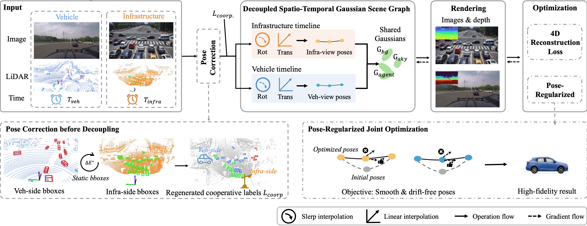
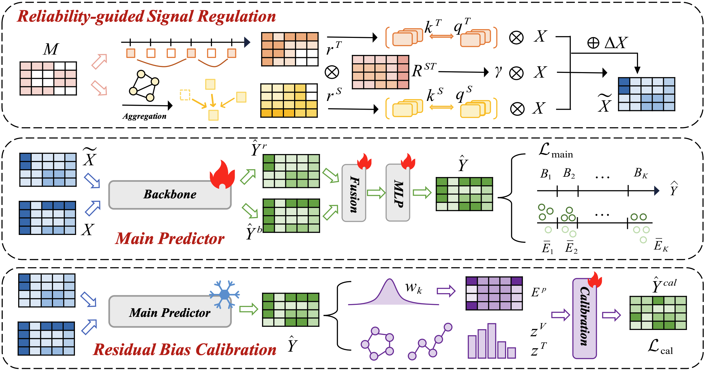

I'm Yulong Chen, a incoming 2027summer Ph.D. student in the College of Computing at [City University of Hong Kong](https://www.cityu.edu.hk/cc/), supervised by Prof. [Kai Wang](https://wangkai930418.github.io/) and Prof. [Kede Ma](https://scholars.cityu.edu.hk/en/persons/kedema/). I am currently working as a research assistant on KAI Lab at [City University of Hong Kong](https://cityu-dg.edu.cn/en/home.html).
My research interest includes 3D Generation, World Models, and Spatio-Temporal Modeling.

Previously, I received my master’s degree from [City University of Hong Kong](https://www.cityu.edu.hk) in 2026, where I was supervised by Prof. [Jianping Wang (IEEE Fellow)](https://scholar.google.com/citations?user=bow_liAAAAAJ&hl=en) and Prof. [Yifan Zhang](https://yifanny.github.io/) from the College of Computing at [City University of Hong Kong](https://www.cityu.edu.hk/cc/). I received my bachelor’s degree from [Hubei Normal University](https://www.hbnu.edu.cn/) in 2023, where I got National Scholarship and was supervised by Prof. [Bihui Yu](https://people.ucas.edu.cn/~yubihui) from the Shenyang Institute of Computing Technology (SICT), [University of Chinese Academy of Sciences](https://english.ucas.ac.cn/).

News
======
🎉 [05.2026] One paper has been submitted to [Scientific Data](https://www.nature.com/sdata/)!  
🎉 [05.2026] Three papers have been submitted to [NeurIPS 2026](https://neurips.cc/)!  
🎉 [04.2026] One paper got accepted to [ICIC 2026](http://ic-icc.cn/)! 
🎉 [06.2025] One paper got accepted to [ECML-PKDD 2025](https://ecmlpkdd.org/2025/)! 
🎉 [06.2023] One paper got accepted to [KSEM 2023](https://www.ksem2023.conferences.academy/)! 

Selected Publications \[[Google Scholar](https://scholar.google.com/citations?user=WAzerzwAAAAJ&hl=zh-CN)\]
\* denotes equal contributions, † denotes corresponding author, ‡ denotes project lead. 

  
  

    <h3 style="margin: 0;"><a href="https://arxiv.org/abs/2605.07910" style="text-decoration: none;">One World, Dual Timeline: Decoupled Spatio-Temporal Gaussian Scene Graph for 4D Cooperative Driving Reconstruction</a></h3>
    

          <strong>Yulong Chen*</strong>, Xiaoyun Dong*, Haoyu Zhang*, Zongxian Yang, Lewei Xie, Xinke Li†, Yifan Zhang†, Kai Wang†, Jianping Wang
           
          <b><i>Arxiv. Target NeurIPS 2026</i></b> 
          <a href="https://arxiv.org/abs/2605.07910" style="text-decoration: none;">[Arxiv]</a>
    

    

      
    

  

  
  

    <h3 style="margin: 0;"><a href="https://arxiv.org/abs/2603.05301" style="text-decoration: none;">Uniform Inductive Spatio-Temporal Kriging</a></h3>
    

          Lewei Xie*, Haoyu Zhang*, <strong>Yulong Chen*</strong>, Liangjun You, Zongxian Yang, Yifan Zhang†
           
          <b><i>Arxiv. Target NeurIPS 2026</i></b> 
          <a href="https://arxiv.org/abs/2603.05301" style="text-decoration: none;">[Arxiv]</a>
    

    

      
    

  

Awards
======
* \[2022\] **China National Scholarship**
